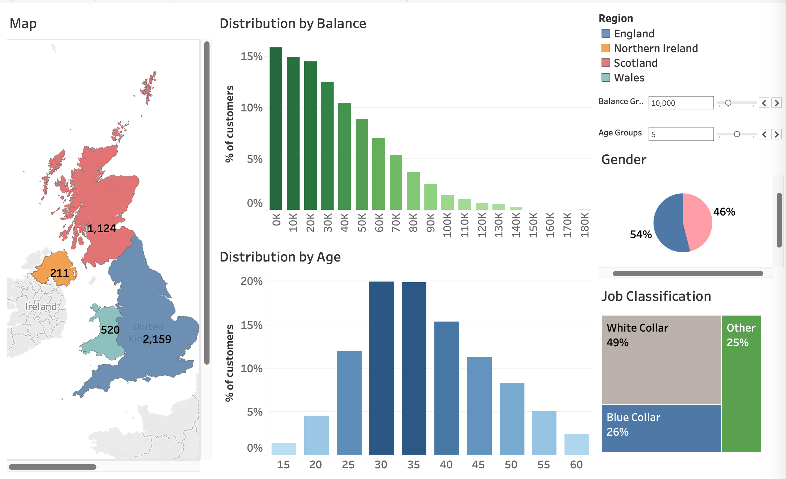
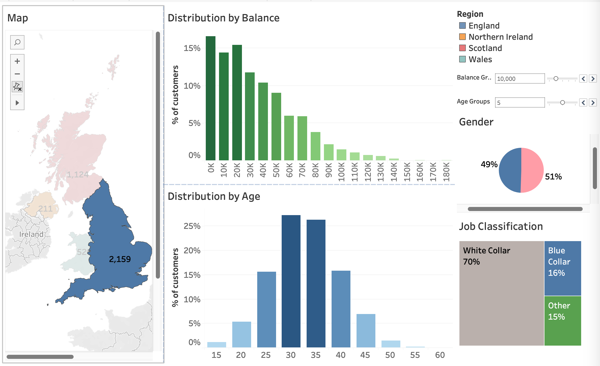
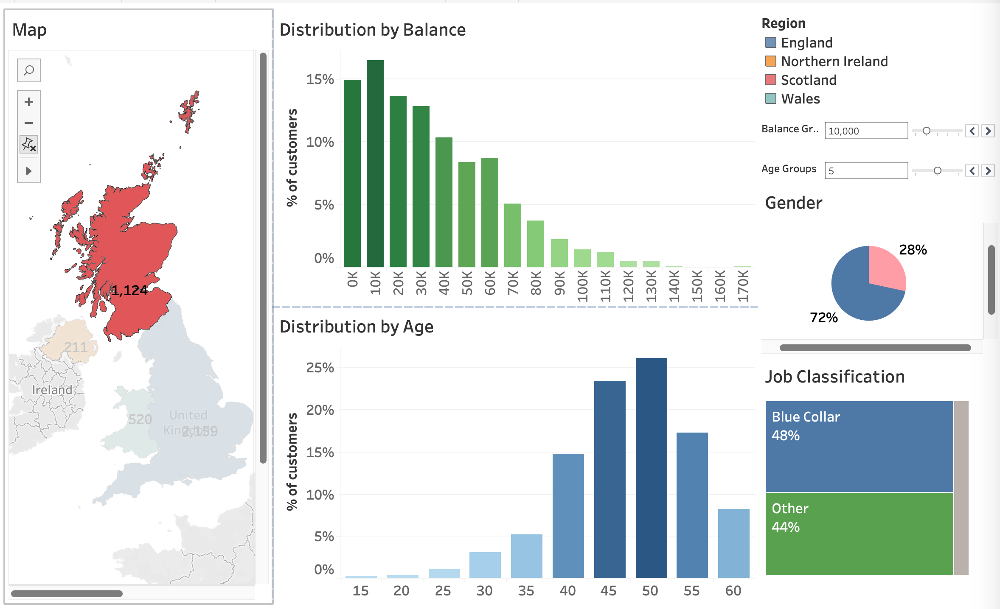
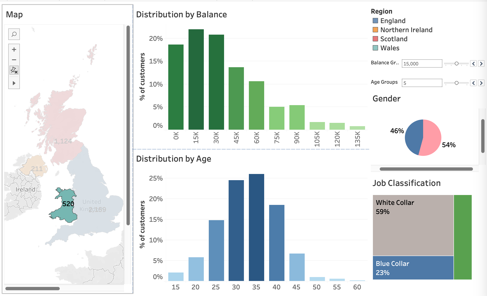

# UK Retail Bank — Customer Demographics Dashboard

An interactive **Tableau** dashboard exploring a UK retail bank's customer base across the four UK nations. The dashboard lets a user drill into any region and instantly see how that segment differs by **account balance, age, gender, and occupation** — turning a flat customer table into a self-serve segmentation tool.

---

## Dashboard preview

**National view (all regions)**

**England selected**

**Scotland selected**

**Northern Ireland selected**

**Wales selected**

🔗 **[View the live dashboard on Tableau Public](https://public.tableau.com/app/profile/mozi.agara/viz/CustomerSegmentationUK_17748335502880/CustomerSegmentation)**

---

## What it does

The dashboard is a single linked view with five coordinated components. Selecting a region on the map (or using the **Region** legend) filters every other chart, so each panel always reflects the currently selected segment.

| Component | What it shows |
|-----------|---------------|
| **Map** | Customer counts per UK nation, used as the primary filter |
| **Distribution by Balance** | Share of customers across account-balance bands |
| **Distribution by Age** | Age profile of the selected segment |
| **Gender** | Gender split for the selected segment |
| **Job Classification** | Occupation mix (White Collar / Blue Collar / Other) |

### Interactive features

- **Region filtering** — clicking a nation on the map redraws the four supporting charts for that segment.
- **Dynamic balance binning** — a *Balance Group* parameter controls the width of the balance bands (e.g. £10,000 vs £15,000 buckets) so users can view the distribution at different granularities.
- **Dynamic age binning** — an *Age Groups* parameter switches the histogram between 5-year and 10-year age bands.
- **Coordinated colour encoding** — a consistent regional colour scheme across the map and legend keeps the view readable.

---

## Insights

The point of the regional filter is that the four nations look quite different. A few observations the dashboard surfaces:

- **Customer base is concentrated in England** (~2,159 customers), followed by Scotland (~1,124), Wales (~520) and Northern Ireland (~211).
- **England** skews **white-collar (~70%)** with a near-even gender split and a customer base concentrated in the 30–35 age range.
- **Scotland** has an **older profile** (peaking around 45–55), a heavier **blue-collar** mix (~48%) and a strong skew toward one gender group (~72/28).
- **Northern Ireland** has the **youngest base** (peaking around 25), is dominated by **"Other"** occupations (~50%) and skews the opposite way on gender (~26/74).
- **Wales** is **white-collar led (~59%)** with a working-age profile centred on 30–35.
- Across every region, **account balances are right-skewed** — most customers sit in the lower balance bands, with a long thin tail of high-balance accounts.
---

## Tools & techniques

- **Tableau** — dashboard layout, linked filtering, parameters for dynamic binning, choropleth map, mixed chart types (bar, pie, marimekko-style stacked view)
- **SQL / Excel** — source data preparation and shaping prior to load
- **Data design** — binning continuous fields (age, balance) into analysis-ready bands; consistent colour and labelling for cross-chart comparison

---

## Data

The dashboard uses a customer demographics dataset for a UK retail bank, with one row per customer and the following fields:

- `Region` — England, Scotland, Wales, Northern Ireland
- `Age` - 18 and above
- `Balance` — account balance
- `Gender` - M/F
- `Job Classification` — White Collar / Blue Collar / Other

> The raw dataset and preparation scripts are **not included** in this repository.
